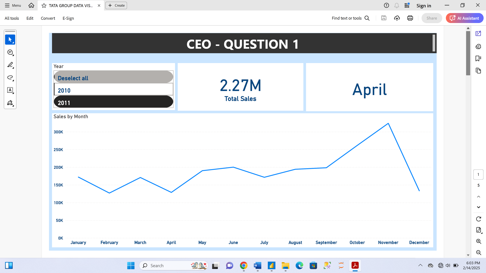

# Tata-Group_Data-Visualization.

___

## Introduction
This project analyzes online retail sales data for **Tata Group** to uncover revenue trends, customer behavior, and market demand. It highlights seasonal patterns, top-performing countries and customers, and expansion opportunities to support data-driven decision-making for business growth.

## Problem Statement
1. The CEO of the retail store is interested to view the time series of the revenue data for the year 2011 only.
2. The CMO is interested in viewing the top 10 countries which are generating the highest revenue. Additionally, the CMO is also interested in viewing the quantity sold along with the revenue generated. The CMO does not want to have the United Kingdom in this visual.
3. The CMO of the online retail store wants to view the information on the top 10 customers by revenue. He is interested in a visual that shows the greatest revenue generating customer at the start and gradually declines to the lower revenue generating customers.
4. The CEO is looking to gain insights on the demand for their products. He wants to look at all countries and see which regions have the greatest demand for their products

## Skills and Concepts Demonstrated
The following Excel and Power Bi skills were demonstrated
- Dax,quick measures,
- Text to column ( to seperate time and date)
- Filters,
- New Measure,
- If function

  ## Visualization
  This report comprises of 4 Pages. each representing a visual for the questions asked by the Ceo and Cmo.

  ## Analysis
  ### Question 1
  

  This Visulaization shows :
- Peak Sales Periods: Revenue spiked in [August, September,October,November December, likely due to seasonal demand, promotions, or holiday shopping.
- Low Sales Periods: Declines were observed in [February, April], possibly due to post-holiday slowdowns or lower consumer spending.
- Consistent Patterns: Recurring trends indicate strong seasonal influences, suggesting customer buying behavior is predictable.

## Question 2

This analysis highlights the top 10 countries contributing the highest revenue, excluding the United Kingdom as requested. Additionally, 
the quantity sold has been analyzed alongside revenue to provide a deeper understanding of the sales performance.
** Key observations include: **
- High Revenue vs. Low Quantity Sold : Some countries generate high revenue despite selling fewer units, indicating higher-priced products or premium markets.
- High Quantity Sold vs. Moderate Revenue : Other countries sell large quantities but generate moderate revenue, possibly due to lower-priced products or bulk discounts.
- Market Concentration : A few countries dominate the revenue share, suggesting potential opportunities for targeted marketing or expansion.

## Question 3

The analysis of the top 10 customers by revenue highlights how much of the company’s sales depend on a small group of high-value customers. This insight is crucial because:
1.	Opportunities for Growth & Retention:
- Since these customers contribute significantly to revenue, they should be given priority in customer engagement strategies, such as exclusive offers, loyalty programs, or personalized experiences.- - 	- 
- Understanding their buying patterns and preferences can help the company tailor its product offerings and services to further increase their lifetime value.
2.	Risk of Over-Reliance:
- If a large portion of revenue comes from only a few customers, losing any of them could significantly impact overall sales.
- The company needs to diversify its customer base by identifying mid-tier customers with potential to grow into high-value buyers.

## Question 4

The analysis of product demand across various countries highlights key regions with the highest sales volume, helping the CEO identify potential markets for expansion.
Key Insights:
1.	High-Demand Regions:
- Certain countries show consistently strong demand, making them prime targets for business expansion.
- Understanding the factors driving demand (e.g., product preferences, economic conditions, or market trends) can help in customizing marketing and distribution strategies.
2.	Market Expansion Potential:
- Countries with high sales volume but no established presence present a strong case for entry through regional partnerships, increased distribution, or localized marketing efforts.
- Comparing these regions to existing markets can help determine scalability and investment feasibility.
3.	Excluding the UK:
- Since the CEO is only interested in expansion opportunities, the analysis excludes the United Kingdom, focusing solely on growth potential in other countries.

## Conclusion
In summary, this analysis provides key insights into revenue trends, market demand, and customer behavior. By leveraging these findings, the company can optimize sales strategies, 
